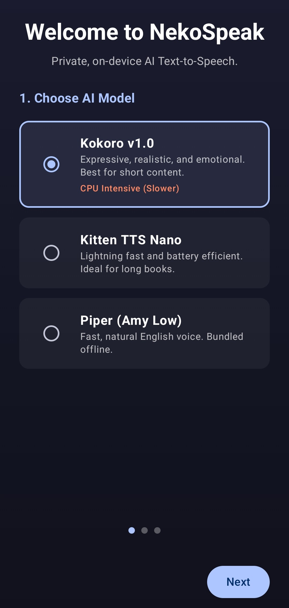
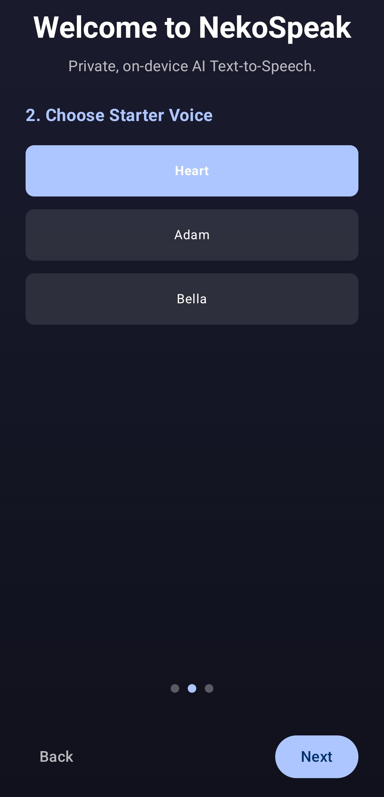
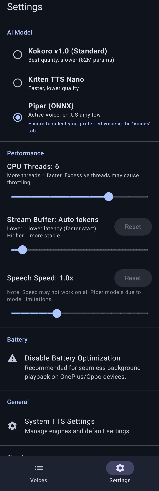
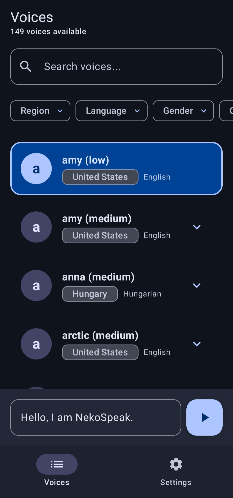
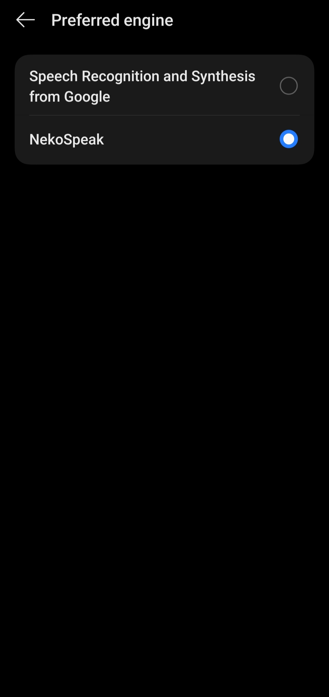
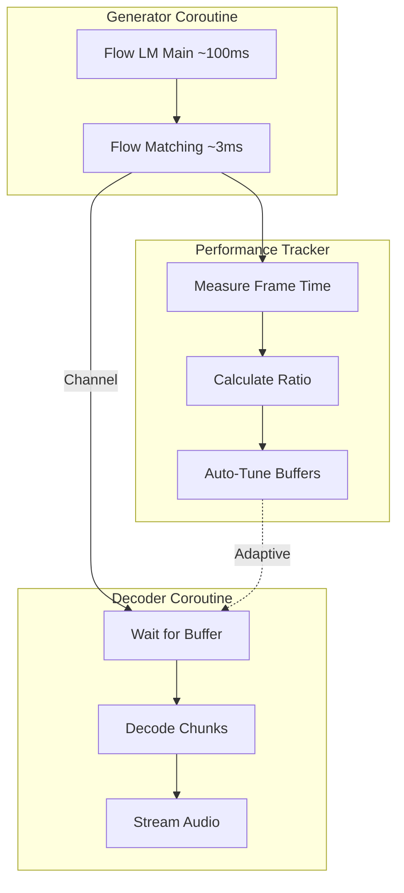
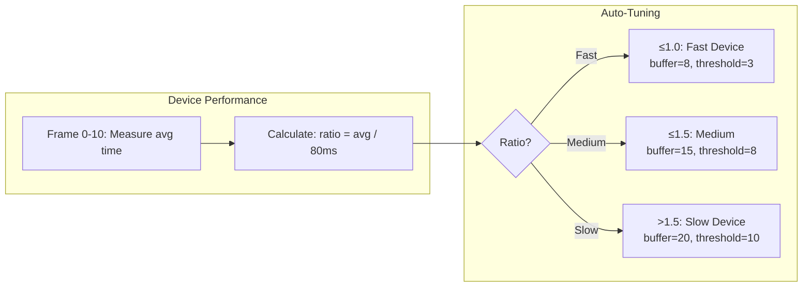

# NekoSpeak


[](https://github.com/siva-sub/NekoSpeak/releases)
[](https://github.com/siva-sub/NekoSpeak/blob/main/LICENSE)
[](https://github.com/siva-sub/NekoSpeak/stargazers)


[-blue?style=for-the-badge&logo=android)](https://github.com/siva-sub/NekoSpeak/releases)

**NekoSpeak** is a high-performance, on-device Text-to-Speech (TTS) engine for Android, capable of running **100% offline** with low latency. It bridges the gap between modern AI voice synthesis and the standard Android TTS API.

## 🎯 Motivation

This project was born from two key inspirations:

1. **Accessibility and Custom Voices** - While watching **Ahren Belisle**, a non-verbal stand-up comedian with cerebral palsy who uses a text-to-speech app on his phone to deliver his comedy routines, I was struck by how powerful TTS technology can be as a voice for those who need it. It made me wonder about custom voices and how high-quality, expressive TTS could be a life-changing quality-of-life improvement for many people.

2. **Natural Audiobook Reading** - I wanted to read books from my **MoonReader** app and have them sound somewhat natural without relying on cloud-based services.

The first and foremost consideration was **fully offline functionality** - no internet required, no data sent anywhere, complete privacy.

> **Future Plans**: Newer models like **Qwen 3-TTS** are very promising, and I plan to experiment with quantized ONNX versions if they become available. The goal is always to maintain offline-first functionality.

## ✨ Features

*   **Multi-Engine Support**:
    *   **Pocket-TTS** ⭐ **RECOMMENDED**: Zero-shot voice cloning with celebrity voices and custom voice enrollment. Best quality and most natural sounding!
    *   **Piper**: Fast, efficient, and multilingual. Supports hundreds of community voices (English, Tamil, Spanish, etc.).
*   **Voice Cloning**: Record your own voice or upload audio to create custom TTS voices (Pocket-TTS).
*   **Celebrity Voices**: Download and use celebrity voice profiles (Oprah Winfrey, Greta Thunberg, and more).
*   **Privacy First**: All processing happens 100% on-device. No data is ever sent to the cloud.
*   **System-Wide Integration**: Works with any Android app that supports TTS (MoonReader, @Voice, etc.).
*   **Advanced Voice Management**:
    *   **Cloud Voice Store**: Browse and download hundreds of Piper voices directly within the app.
    *   **Quality Filters**: Filter voices by quality (x_low to high).
    *   **Persistence**: Remembers your preferred voice and speed settings.

## 📦 Bundled Models

> **What's included?** Only **Piper with Amy Low voice** (~63MB) is bundled for instant offline use. Other engines (Kokoro, Kitten TTS, Pocket-TTS) are downloaded on-demand when you select them. We recommend trying **Pocket-TTS** for the best quality experience!

| Engine | Model | Size | Quality | Availability |
|--------|-------|------|---------|--------------|
| Piper | Amy Low | ~63MB | Good | ✅ Bundled (instant) |
| Pocket-TTS | Full Model | ~176MB | Excellent | 📥 On-demand. **Recommended!** |
| Kokoro | v1.0 | ~115MB | Excellent | 📥 On-demand |
| Kitten TTS | Nano | ~23MB | Fair | 📥 On-demand |
| Piper | Community Voices | Varies | Varies | 📥 100+ downloadable voices |

## 📸 Screenshots

| Onboarding | Voice Selection | Settings |
|:---:|:---:|:---:|
|  |  |  |

| Voice Downloader | System Selection |
|:---:|:---:|
|  |  |

## 📥 Download

**v1.2.0 is now available!**

> **Why is the APK size large?**
> NekoSpeak comes pre-packaged with the Piper engine and Amy Low voice to ensure **100% offline functionality** right out of the box. The Pocket-TTS model is downloaded separately on first use.

*   **Universal** (~135 MB): Works on all devices.
    *   [Download apk](https://github.com/siva-sub/NekoSpeak/releases/download/v1.2.0/app-universal-release.apk)
*   **arm64-v8a** (~88 MB): Optimized for modern devices (Pixel, Samsung S-series).
    *   [Download apk](https://github.com/siva-sub/NekoSpeak/releases/download/v1.2.0/app-arm64-v8a-release.apk)
*   **armeabi-v7a** (~82 MB): Optimized for older/low-end devices.
    *   [Download apk](https://github.com/siva-sub/NekoSpeak/releases/download/v1.2.0/app-armeabi-v7a-release.apk)

[**View Full Release Notes**](https://github.com/siva-sub/NekoSpeak/releases/tag/v1.2.0)

## 📂 Project Structure

```text
.
├── app
│   ├── src
│   │   ├── main
│   │   │   ├── java/com/nekospeak/tts  (Kotlin Source)
│   │   │   ├── cpp/                    (Native C++ / JNI)
│   │   │   ├── assets/                 (Bundled Models)
│   │   │   └── res/                    (UI Resources)
│   ├── build.gradle.kts                (App Build Config)
├── gradle                              (Gradle Wrapper)
├── build.gradle.kts                    (Root Build Config)
└── README.md                           (Documentation)
```

## 🛠️ Technical Details

For a detailed architectural breakdown, component analysis, system integration diagrams, and ONNX implementation details, please refer to the **[Technical Deep Dive](TECHNICAL_DEEP_DIVE.md)**.

## 🚀 Adaptive Streaming Engine

NekoSpeak features a **novel adaptive streaming architecture** that automatically optimizes audio generation for any device. This is particularly important for the Pocket-TTS engine, which uses large neural network models that may run slower than real-time on some devices.

### The Challenge

On-device neural TTS faces a fundamental problem: **generation speed varies by device**. A flagship phone might generate audio faster than real-time, while a budget device might run at 50% speed. Traditional approaches either:
- Buffer everything first (long wait times)
- Stream immediately (choppy audio on slower devices)

### Our Solution: Self-Tuning Parallel Streaming



### How It Works

1. **Parallel Coroutines**: Generator and decoder run concurrently using Kotlin coroutines with a channel buffer
2. **Real-Time Performance Measurement**: Tracks generation time for each frame and calculates the ratio vs playback speed
3. **Automatic Buffer Tuning**: Adjusts buffer sizes based on measured device performance



### Adaptive Parameters

| Device Speed | Ratio | Initial Buffer | Decode Threshold | Reserve |
|--------------|-------|----------------|------------------|---------|
| **Faster than real-time** | ≤1.0 | 8 frames (~640ms) | 3 | 2 |
| **Slightly slower** | ≤1.2 | 10 frames | 5 | 2 |
| **Moderately slower** | ≤1.5 | 15 frames (~1.2s) | 8 | 4 |
| **Quite slow** | ≤2.0 | 20 frames (~1.6s) | 10 | 6 |
| **Very slow** | >2.0 | 30 frames (~2.4s) | 10 | 6 |

### Key Benefits

- **Zero Configuration**: Works optimally on any device without user tuning
- **Smooth Playback**: Larger buffers on slower devices prevent audio gaps
- **Lower Latency**: Faster devices get smaller buffers for quicker startup
- **Continuous Adaptation**: Re-measures every 10 frames to handle thermal throttling

### Known Limitations

> **Note**: Even with adaptive streaming, **very long sentences may still experience some choppiness** on slower devices. This is because the entire pipeline runs on **CPU-only ONNX inference** - we deliberately avoid GPU/NPU acceleration (NNAPI, QNN) as these accelerators don't support all operations in the transformer models.
>
> For the smoothest experience on long audiobook chapters, consider using **Batch mode** in settings, which generates all audio before playback.
>
> **Future**: We're exploring Qualcomm QNN and custom ONNX Runtime builds for potential GPU acceleration on compatible devices.


## 🏗️ Build Instructions

1.  Clone the repository.
2.  Open in Android Studio (Ladybug+).
3.  Build and Run (`Shift + F10`).
    *   *Note: Ensure NDK is installed for C++ builds.*

## Credits & Acknowledgements

I gratefully acknowledge the incredible work of the open-source AI community:

*   **[Pocket-TTS (Original Model)](https://github.com/kyutai-labs/pocket-tts)**
    *   Thanks to **Kyutai Labs** for the original Pocket-TTS model and default voices.
*   **[Pocket-TTS ONNX Export](https://github.com/KevinAHM/pocket-tts-onnx-export)** & **[Models](https://huggingface.co/KevinAHM/pocket-tts-onnx)**
    *   Thanks to **KevinAHM** for the ONNX export tool and reference implementation that made this Android port possible.
*   **[Celebrity Voice Dataset](https://huggingface.co/datasets/sdialog/voices-celebrities)**
    *   Thanks to **sdialog** for the celebrity voice samples used for voice cloning.
*   **[Kokoro-ONNX](https://github.com/thewh1teagle/kokoro-onnx)**
    *   Thanks to [thewh1teagle](https://github.com/thewh1teagle) for the inspiration and ONNX export work.
*   **[KittenTTS](https://github.com/KittenML/KittenTTS)**
    *   Thanks to the KittenML team for their work on efficient TTS architectures.
*   **[Piper](https://github.com/rhasspy/piper)** & **[Piper Voices](https://huggingface.co/rhasspy/piper-voices)**
    *   Thanks to the Rhasspy team for the amazing Piper architecture and the massive collection of high-quality voices.
*   **[Piper Tamil Voice (Valluvar)](https://huggingface.co/datasets/Jeyaram-K/piper-tamil-voice)**
    *   Special thanks to **Jeyaram-K** for training and providing the high-quality Tamil "Valluvar" model.
*   **[Misaki](https://github.com/hexgrad/misaki)**
    *   G2P logic ported from this excellent library.
*   **[Espeak-NG](https://github.com/espeak-ng/espeak-ng)**
    *   The backbone of multilingual phonemization.

## License

**NekoSpeak** is licensed under the **MIT License**.

> **Note**: While the NekoSpeak application code is MIT, it bundles dependencies with their own licenses:
> *   **Espeak-NG**: GPL v3.0
> *   **ONNX Models**: Apache 2.0 / CC-BY-4.0 (Check specific model licenses)

## Author

Developed by **Sivasubramanian Ramanathan**
*   [LinkedIn](https://www.linkedin.com/in/sivasub987/)
*   [Website](https://sivasub.com/)
