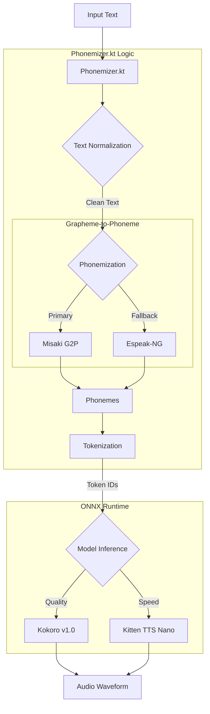

# NekoSpeak

**NekoSpeak** is a private, on-device AI Text-to-Speech (TTS) engine for Android. It combines the expressive power of **Kokoro v1.0** with the lightning-fast efficiency of **Kitten TTS Nano** to provide a premium listening experience that respects your privacy.

## Features

*   **Dual Model Support**:
    *   **Kokoro v1.0 (82M)**: High-quality, expressive narration. Perfect for short reads and notifications.
    *   **Kitten TTS Nano**: Extremely lightweight and fast. Ideal for long-form content like e-books.
*   **Privacy First**: All processing happens 100% on-device. No data is ever sent to the cloud.
*   **Battery Friendly**: Optimized for minimal power consumption.
*   **System-Wide Integration**: Works with any Android app that supports TTS (MoonReader, @Voice, etc.).
*   **Multiple Voices**: Includes a variety of voices (Heart, Adam, Bella, etc.) with region and gender filtering.

> **Note**: Due to GitHub file size limits, the ONNX models are provided in the [Releases](https://github.com/siva-sub/NekoSpeak/releases) section. Download and place them in `app/src/main/assets/` to build locally.

## Architecture

The following diagram illustrates the NekoSpeak processing pipeline:



## Screenshots

<p align="center">
  
  
</p>

## Credits & Acknowledgements

This project stands on the shoulders of giants. We gratefully acknowledge the following open-source projects:

*   **[KittenTTS](https://github.com/KittenML/KittenTTS)** (Apache 2.0)
    *   A massive thanks to the KittenML team for their incredible work on efficient TTS architectures.
*   **[Kitten TTS Nano Model](https://huggingface.co/KittenML/kitten-tts-nano-0.1)** (Apache 2.0)
    *   The 0.1 Nano model provides the speed and efficiency backbone of this app.
*   **[Kokoro-ONNX](https://github.com/thewh1teagle/kokoro-onnx)** (Apache 2.0)
    *   Reference implementation for running Kokoro models via ONNX Runtime. **Huge thanks** to [thewh1teagle](https://github.com/thewh1teagle) for the inspiration and the amazing work on the ONNX export.
*   **[Misaki](https://github.com/hexgrad/misaki)**
    *   G2P (Grapheme-to-Phoneme) logic was ported from this excellent library.
*   **[Espeak-NG](https://github.com/espeak-ng/espeak-ng)** (GPL 3.0)
    *   Used as a robust fallback for complex phonemization tasks.

## License

**NekoSpeak** is licensed under the **MIT License**.

> **Note**: While the NekoSpeak application code is MIT, it bundles dependencies with their own licenses:
> *   **Espeak-NG**: GPL v3.0
> *   **ONNX Models**: Apache 2.0

```text
MIT License

Copyright (c) 2026

Permission is hereby granted, free of charge, to any person obtaining a copy
of this software and associated documentation files (the "Software"), to deal
in the Software without restriction, including without limitation the rights
to use, copy, modify, merge, publish, distribute, sublicense, and/or sell
copies of the Software, and to permit persons to whom the Software is
furnished to do so, subject to the following conditions:

The above copyright notice and this permission notice shall be included in all
copies or substantial portions of the Software.

THE SOFTWARE IS PROVIDED "AS IS", WITHOUT WARRANTY OF ANY KIND, EXPRESS OR
IMPLIED, INCLUDING BUT NOT LIMITED TO THE WARRANTIES OF MERCHANTABILITY,
FITNESS FOR A PARTICULAR PURPOSE AND NONINFRINGEMENT. IN NO EVENT SHALL THE
AUTHORS OR COPYRIGHT HOLDERS BE LIABLE FOR ANY CLAIM, DAMAGES OR OTHER
LIABILITY, WHETHER IN AN ACTION OF CONTRACT, TORT OR OTHERWISE, ARISING FROM,
OUT OF OR IN CONNECTION WITH THE SOFTWARE OR THE USE OR OTHER DEALINGS IN THE
SOFTWARE.
```

