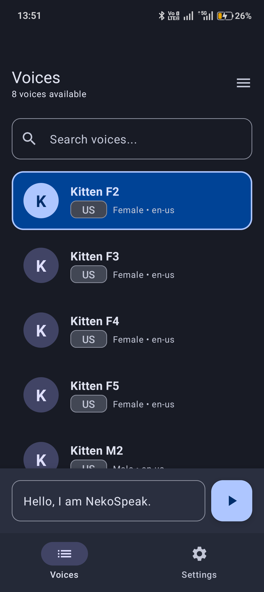
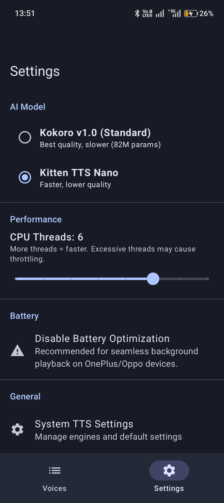
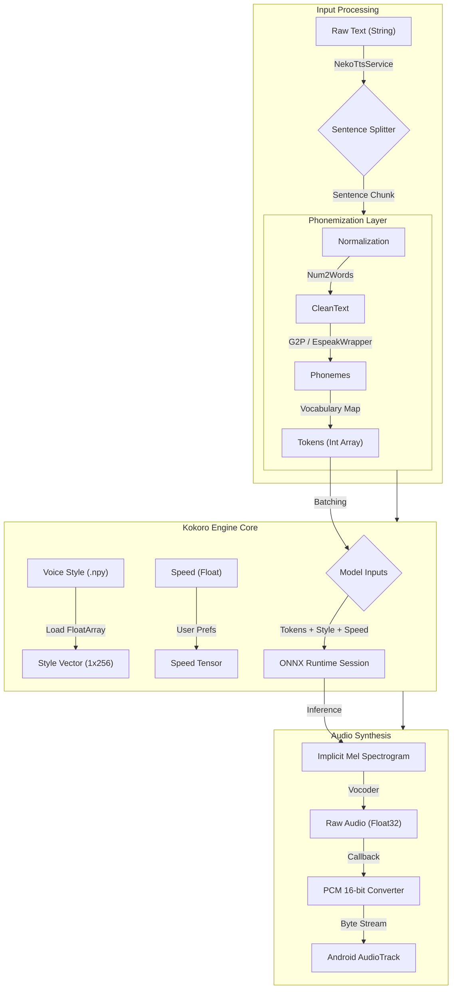

[](https://github.com/siva-sub/NekoSpeak/releases)
[](https://github.com/siva-sub/NekoSpeak/blob/main/LICENSE)
[](https://github.com/siva-sub/NekoSpeak/stargazers)


[-blue?style=for-the-badge&logo=android)](https://github.com/siva-sub/NekoSpeak/releases)


**NekoSpeak** is a private, on-device AI Text-to-Speech (TTS) engine for Android. It combines the expressive power of **Kokoro v1.0** with the lightning-fast efficiency of **Kitten TTS Nano**.

<p align="center">
  
  
</p>

### 📥 Download
**v1.0.4 is now available!**
*   **Universal**: Works on all devices (larger size).
*   **arm64-v8a**: Optimized for modern devices (Pixel, Samsung S-series).
*   **armeabi-v7a**: Optimized for older/low-end devices.

[**Download from Releases**](https://github.com/siva-sub/NekoSpeak/releases)

## Author
Developed by **Sivasubramanian Ramanathan**
*   [LinkedIn](https://www.linkedin.com/in/sivasub987/)
*   [Website](https://sivasub.com/)

## Features

*   **Dual Model Support**:
    *   **Kokoro v1.0 (82M)**: High-quality, expressive narration. Perfect for short reads and notifications.
    *   **Kitten TTS Nano**: Extremely lightweight and fast. Ideal for long-form content like e-books.
*   **Privacy First**: All processing happens 100% on-device. No data is ever sent to the cloud.
*   **Battery Friendly**: Optimized for minimal power consumption.
*   **System-Wide Integration**: Works with any Android app that supports TTS (MoonReader, @Voice, etc.).
*   **Multiple Voices**: Includes a variety of voices (Heart, Adam, Bella, etc.) with region and gender filtering.

> **Note**: The **Release APK** (v1.0.4+) includes specialized builds for **arm64** and **armv7**. No additional downloads required!
>
> If you are building from source, you must manually download the ONNX models from [Releases](https://github.com/siva-sub/NekoSpeak/releases) and place them in `app/src/main/assets/`.

## Architecture

**NekoTtsService** vs **KokoroEngine**:
*   **NekoTtsService**: The **Face** of the app. Handles Android TTS API requests, thread management, and audio streaming callbacks.
*   **KokoroEngine**: The **Brain**. Handles Model/ONNX inference, Tokenization, and raw audio synthesis.

### Technical Deep Dive: From Text to Audio

The core of NekoSpeak is a pipeline that transforms raw text into synthesized audio. This process involves several critical stages, each handled by specific components.

#### 1. Why Preprocess?
Raw text cannot be fed directly into a neural network. It must first be converted into a sequence of **Phonemes** (the distinct units of sound) and then mapped to **Tokens** (integer IDs).
*   **Text**: "Hello"
*   **Phonemes**: `h`, `ə`, `l`, `oʊ`
*   **Tokens**: `[24, 83, 28, 57]`

Preprocessing ensures the model "pronounces" words correctly, regardless of their spelling (e.g., "rough" vs "dough").

#### 2. The Inference Pipeline

The following diagram illustrates the exact data flow through the application:


#### 3. Component Breakdown

*   **`NekoTtsService.kt`**:
    *   **Role**: Application Entry Point.
    *   **Responsibility**: Receives `SynthesisRequest` from Android. Manages the lifecycle of the engine. Buffer exact bytes to the system `AudioTrack`.
*   **`KokoroEngine.kt`**:
    *   **Role**: Result Orchestrator.
    *   **Flow**:
        1.  **Splitting**: Breaks large paragraphs into sentences to fit context windows.
        2.  **Batching**: Accumulates tokens until `MAX_TOKENS` is reached to maximize inference efficiency.
        3.  **Trimming**: (Kitten specific) Trims silence from generated audio to prevent "robotic" pauses.
*   **`Phonemizer.kt` & `EspeakWrapper.kt`**:
    *   **Role**: Linguistic Processor.
    *   **Process**:
        *   **`Misaki G2P`**: Primary engine. Uses a rule-based system + lexicon for high-speed American/British English phonemization.
        *   **`EspeakWrapper`**: Native JNI fallback. If Misaki fails or a non-English word is encountered, Espeak provides robust phoneme generation.
*   **`TtsEngine.kt`**:
    *   **Role**: System Interface. Defines the contract (`initialize`, `generate`, `release`) for interchangeable backends.

#### 4. ONNX Model Internals

How does **Kokoro/Kitten** actually "speak"?
*   **Inputs**:
    *   `tokens`: The sequence of phoneme IDs (Shape: `[1, N]`).
    *   `style`: A fixed-size embedding vector (Shape: `[1, 256]`) representing the voice's timber (e.g., pitch, resonance). This is chopped from the giant `voices.bin` file.
    *   `speed`: A scalar controlling the duration of phonemes.
*   **Output**:
    *   `audio`: A raw waveform array (Float32). Unlike older TTS which produced Mel Spectrograms requiring a separate Vocoder (HiFiGAN), Kokoro is **End-to-End**, outputting audio directly.


## Credits & Acknowledgements

This project stands on the shoulders of giants. We gratefully acknowledge the following open-source projects:

*   **[KittenTTS](https://github.com/KittenML/KittenTTS)** (Apache 2.0)
    *   A massive thanks to the KittenML team for their incredible work on efficient TTS architectures.
*   **[Kitten TTS Nano Model](https://huggingface.co/KittenML/kitten-tts-nano-0.1)** (Apache 2.0)
    *   The 0.1 Nano model provides the speed and efficiency backbone of this app.
*   **[Kokoro-ONNX](https://github.com/thewh1teagle/kokoro-onnx)** (Apache 2.0)
    *   Reference implementation for running Kokoro models via ONNX Runtime. **Huge thanks** to [thewh1teagle](https://github.com/thewh1teagle) for the inspiration and the amazing work on the ONNX export.
*   **[Misaki](https://github.com/hexgrad/misaki)**
    *   G2P (Grapheme-to-Phoneme) logic was ported from this excellent library.
*   **[Espeak-NG](https://github.com/espeak-ng/espeak-ng)** (GPL 3.0)
    *   Used as a robust fallback for complex phonemization tasks.

## License

**NekoSpeak** is licensed under the **MIT License**.

> **Note**: While the NekoSpeak application code is MIT, it bundles dependencies with their own licenses:
> *   **Espeak-NG**: GPL v3.0
> *   **ONNX Models**: Apache 2.0

```text
MIT License

Copyright (c) 2026

Permission is hereby granted, free of charge, to any person obtaining a copy
of this software and associated documentation files (the "Software"), to deal
in the Software without restriction, including without limitation the rights
to use, copy, modify, merge, publish, distribute, sublicense, and/or sell
copies of the Software, and to permit persons to whom the Software is
furnished to do so, subject to the following conditions:

The above copyright notice and this permission notice shall be included in all
copies or substantial portions of the Software.

THE SOFTWARE IS PROVIDED "AS IS", WITHOUT WARRANTY OF ANY KIND, EXPRESS OR
IMPLIED, INCLUDING BUT NOT LIMITED TO THE WARRANTIES OF MERCHANTABILITY,
FITNESS FOR A PARTICULAR PURPOSE AND NONINFRINGEMENT. IN NO EVENT SHALL THE
AUTHORS OR COPYRIGHT HOLDERS BE LIABLE FOR ANY CLAIM, DAMAGES OR OTHER
LIABILITY, WHETHER IN AN ACTION OF CONTRACT, TORT OR OTHERWISE, ARISING FROM,
OUT OF OR IN CONNECTION WITH THE SOFTWARE OR THE USE OR OTHER DEALINGS IN THE
SOFTWARE.
```

