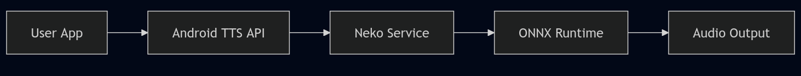

# **NekoSpeak** 🐱
## Engineering Intelligence at the Edge

**Sivasubramanian Ramanathan**
*Product Owner | Fintech & Innovation*
*Ex-BIS Innovation Hub Singapore*

**🌏 Seeking Opportunities in Singapore**
I am looking for roles in **Product Management, Fintech, Payments, RegTech**, and **Digital Assets**.

"I am not just a Product person. **I build.**"

I have worked across product delivery, user research, and cross-agency collaboration. I enjoy solving complex problems and bringing structure to early ideas.

**I care deeply about building products that create real impact.**

---

# **The Problem: AI has a "Last Mile" Issue**

In my work exploring **Fintech & RegTech**, I've seen how reliance on cloud APIs creates bottlenecks. For Voice AI on Android, this manifests as:

1.  🔴 **Latency**: Waiting for server responses breaks natural conversation flow.
2.  🔴 **Privacy Risks**: Sending sensitive audio data to the cloud is unacceptable for many use cases.
3.  🔴 **Robotic Fallback**: Traditional offline engines (`espeak`) sound unnatural.

> **Goal**: Build a "Zero-Compromise" engine that runs mostly on-device.

---

# **The Solution: NekoSpeak** 🚀

A drop-in replacement for the Android TTS ecosystem, bringing heavily quantized Large Audio Models (LAMs) to the mobile edge.

*   **Triple Engine Core**:
    *   🧠 **Kokoro (82M)**: Human-like.
    *   ⚡ **Piper**: Fast & Multilingual.
    *   🏎️ **Kitten (Nano)**: Lightweight.
*   **100% Offline**: No internet needed.

---

# **Technical Architecture** ⚙️

I architected a custom pipeline using **ONNX Runtime** and **C++ JNI Bridges** to optimize performance on mobile CPUs.

*   **Smart Batching**: Dynamic buffering balances latency vs. context window.
*   **Native Bridge**: Custom C++ wrapper for `libespeak-ng` phonemization.

---

# **Deep System Integration** 🔄

Unlike simple "wrapper" apps, NekoSpeak integrates deep into the **Android Framework**.

It handles the full <code>CHECK_TTS_DATA</code> handshake, allowing it to power 3rd party apps (MoonReader, @Voice) system-wide.

---

# **Product Showcase** 📱

Polished UX focusing on accessibility and ease of use.

| Voice Selection | Settings & Config |
|:---:|:---:|
|  |  |

---

# **Engineering Philosophy & Impact** 🌟

This project reflects my approach to Product Engineering:

1.  **Solve Real Problems**: Bridges the gap between "Cool AI Demo" and "Daily Driver Utility".
2.  **Robust Engineering**: "Zero-Crash" architecture with graceful degradation (Cloud -> Local -> Nano).
3.  **User-Centric**: Privacy by default, with no hidden analytics.

*Similar to my work on the **Singapore Location Intelligence MCP** and **Client-Side OCR**.*

---

# **About the Builder** 👨‍💻

**Sivasubramanian Ramanathan**
*Product Owner | Fintech, RegTech & Digital Innovation*
*PMP | PSM II | PSPO II*

I specialize in taking messy, real-world complexity and structuring it into reliable products.

**Open for roles that sit between policy, technology, and stakeholder engagement.**

---

# **Lets Connect** 🤝

I am ready to bring this level of engineering rigor and product thinking to your team.

*   🌐 **Portfolio**: [sivasub.com](https://sivasub.com)
*   💼 **LinkedIn**: [linkedin.com/in/sivasub987](https://www.linkedin.com/in/sivasub987/)
*   💻 **Code**: [github.com/siva-sub/NekoSpeak](https://github.com/siva-sub/NekoSpeak)

 

**Download NekoSpeak v1.0.10**:
[github.com/siva-sub/NekoSpeak/releases](https://github.com/siva-sub/NekoSpeak/releases)
