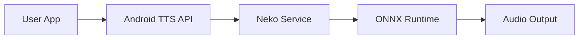

# **NekoSpeak** 🐱
## Next-Gen AI Voice Engine for Android

**100% Offline • Ultra Low Latency • Privacy First**

 

**Built by Sivasubramanian Ramanathan**
*Product Owner | Fintech & Digital Innovation*

---

# **The Problem** 📉

Existing text-to-speech solutions on Android often force a compromise:

1.  **Robotic & Flat**: Older offline engines sound artificial (`espeak`).
2.  **Privacy Invasive**: High-quality usually means sending data to the cloud.
3.  **Latency**: Waiting for server responses breaks the flow of reading.

> "AI should assist us without compromising our privacy or patience."

---

# **The Solution: NekoSpeak** 🚀

A drop-in replacement for the system TTS engine that brings **State-of-the-Art AI** directly to your device.

*   **Triple Engine Core**:
    *   🧠 **Kokoro (82M)**: Human-level expressiveness.
    *   ⚡ **Piper**: Fast, multilingual support.
    *   🏎️ **Kitten (Nano)**: Ultra-lightweight for older reliability.
*   **Privacy by Design**: Zero data leaves the device.
*   **Universal Compatibility**: Works with @Voice, MoonReader, and accessibility tools.

---

# **Technical Engineering** ⚙️

Building for the "Edge" requires specialized architecture:

*   **ONNX Runtime**: Quantized models (int8) for CPU efficiency.
*   **Native C++ Bridge**: Custom JNI wrappers for `espeak-ng` integration.
*   **Smart Batching**: Dynamic token buffering to balance latency vs. context.
*   **Kotlin Coroutines**: Non-blocking audio synthesis pipeline.

---

# **Why I Built This** 💡

My background in **Fintech & Innovation** (ex-BIS Innovation Hub) taught me that the best products solve complex technical problems with simple user experiences.

*   **Offline First**: Exploring trade-offs in model size vs. user experience.
*   **Accessibility**: Making high-quality AI voices available to everyone, free of charge.
*   **Curiosity**: Pushing the limits of what a mobile CPU can do without a cloud GPU.

---

# **About the Builder** 👨‍💻

**Sivasubramanian Ramanathan**
*He/Him*

**Product Owner | Fintech, RegTech & Digital Innovation**
*Ex-BIS Innovation Hub Singapore | PMP | PSM II | PSPO II*

I specialize in bringing structure to complex, early-stage ideas and building products with real impact.

---

# **I'm Looking for My Next Role** 🤝

I am open to opportunities in **Singapore** 🇸🇬:

*   **Roles**: Product Management, Fintech, Payments, RegTech, Digital Assets.
*   **Focus**: Building simple, safe, and genuinely useful solutions.

> "Taking messy, real-world complexity and structuring it into reliable product experiences."

[LinkedIn](https://www.linkedin.com/in/sivasub987) | [Website](https://sivasub.com) | [GitHub](https://github.com/siva-sub/NekoSpeak)

---

### **Download NekoSpeak v1.0.10 Today**

Available now on GitHub Releases.

 
