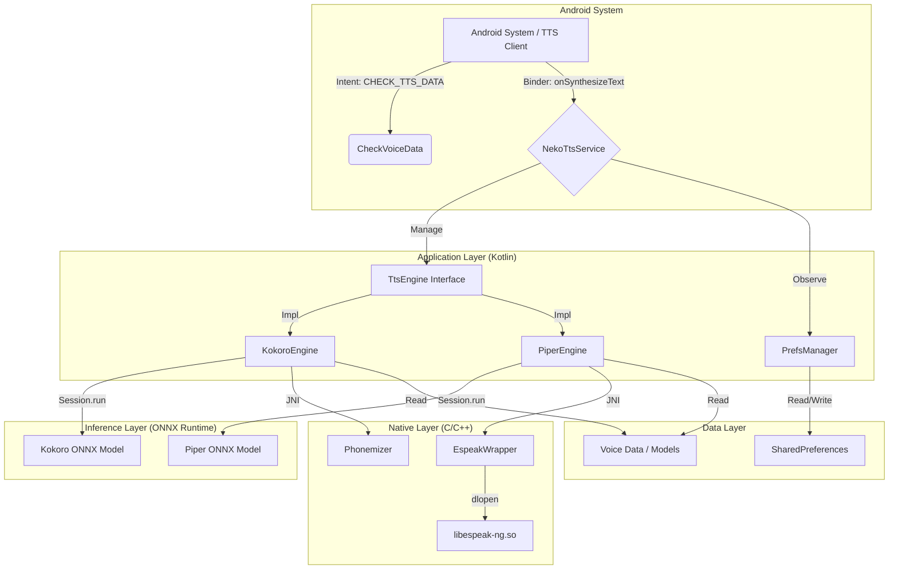
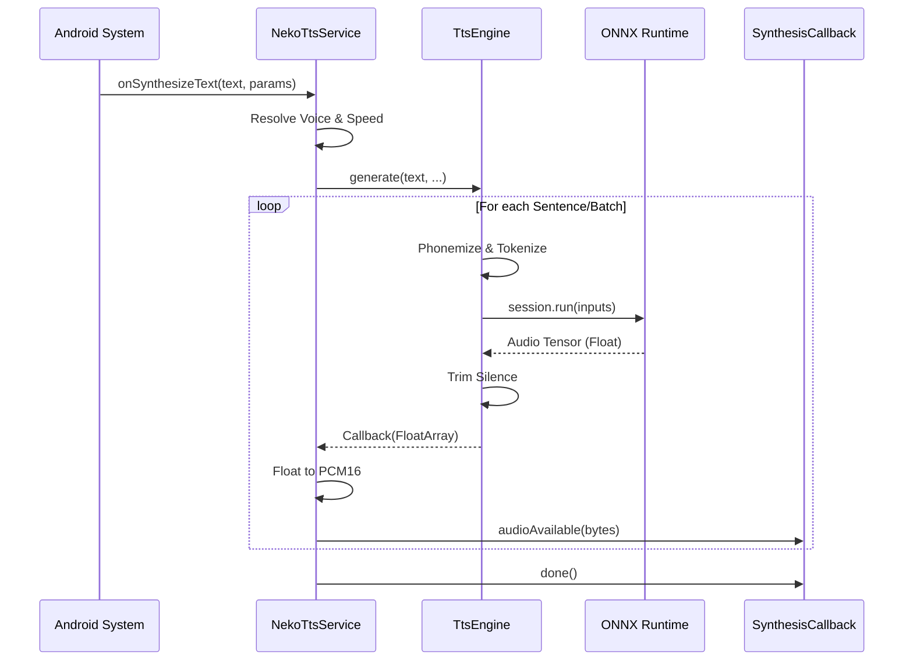

# NekoSpeak Technical Deep Dive

This document provides an expert-level technical analysis of the NekoSpeak Android Text-to-Speech (TTS) application. It details the architecture, data flow, component interactions, and the underlying AI model integration utilizing ONNX Runtime and native C++ libraries.

## 1. System Architecture Overview

NekoSpeak operates as a standard Android `TextToSpeechService`, exposing itself to the system as a selectable TTS engine. Internally, it bridges the Java/Kotlin application layer with high-performance native inference engines via JNI and ONNX Runtime.



### 1.1. System Integration & APIs

NekoSpeak integrates with the Android Text-to-Speech framework via specific **Intents** and **Service Bindings** defined in `AndroidManifest.xml`. This ensures seamless operation as a system-wide TTS provider.


#### Key APIs & Intents

| Component | Intent Action | Purpose |
| :--- | :--- | :--- |
| **NekoTtsService** | `android.intent.action.TTS_SERVICE` | The core Binder interface. Allows the system to synthesize text, query voices, and stop playback. |
| **CheckVoiceData** | `android.speech.tts.engine.CHECK_TTS_DATA` | Called by the system to verify if voice data is installed. NekoSpeak returns `CHECK_VOICE_DATA_PASS` if models are present (or auto-extracts them). |
| **InstallVoiceData** | `android.speech.tts.engine.INSTALL_TTS_DATA` | Triggers the voice installation UI if `CHECK_TTS_DATA` fails (rarely used as we bundle/auto-extract assets). |
| **GetSampleText** | `android.speech.tts.engine.GET_SAMPLE_TEXT` | Returns a localized sample string (e.g., "This is an example...") for the system settings preview. |

## 2. Component Analysis

### 2.1. NekoTtsService (`com.nekospeak.tts.NekoTtsService`)
This is the core service extending `android.speech.tts.TextToSpeechService`. It handles the lifecycle of the TTS engine and routes synthesis requests.

-   **Lifecycle Management**:
    -   `onCreate()`: Initializes `PrefsManager` and triggers the initial engine load via `reloadEngine()`.
    -   `onStop()`: Sets a `stopRequested` flag to interrupt audio streaming during synthesis.
    -   `onDestroy()`: Resources cleanup and coroutine cancellation.

-   **Synthesis Pipeline (`onSynthesizeText`)**:
    1.  **Request Handling**: Receives `SynthesisRequest` containing text and metadata.
    2.  **Engine Synchronization**: Waits for the asynchronous `initJob` to complete using `runBlocking` with a timeout, ensuring the engine is ready.
    3.  **Voice Selection**: Determines the voice based on request parameters or user preferences.
    4.  **Audio Generation**: Calls `currentEngine.generate`.
    5.  **Streaming**: Receives float arrays from the engine, converts them to PCM 16-bit integers, and writes them to the `SynthesisCallback` buffer.

-   **Dynamic Engine Reloading**: Monitors `SharedPreferences` for changes in model selection (`kokoro` vs `piper`) or CPU thread counts, triggering an atomic hot-swap of the underlying `TtsEngine` instance.

### 2.2. Engine Abstraction (`TtsEngine` Interface)
To support multiple model architectures, the app uses a unified interface:

```kotlin
interface TtsEngine {
    suspend fun initialize(): Boolean
    suspend fun generate(text: String, speed: Float, voice: String?, callback: (FloatArray) -> Unit)
    fun getSampleRate(): Int
    fun getVoices(): List<String>
    // ...
}
```

### 2.3. Kokoro & Kitten Engine (`KokoroEngine.kt`)
This class manages inference for both the **Kokoro** (82M params) and **Kitten** (35M params, lower latency) models.

-   **Model Selection**:
    -   Based on `PrefsManager.currentModel`.
    -   **Kokoro**: Uses `kokoro-v1.0.int8.onnx` and `voices-v1.0.bin`.
    -   **Kitten**: Uses `kitten_tts_nano_v0_1.onnx` and `voices.npz`.

-   **Data Flow**:
    1.  **Text Preprocessing**: Splits input text into sentences using regex to optimize for the model's context window.
    2.  **Phonemization**: Uses a custom `Phonemizer` to convert text to phonemes.
    3.  **Tokenization**: Maps phonemes to integer tokens compatible with the ONNX model.
    4.  **Batching Strategy**:
        -   **Kokoro**: Accumulates ~150 tokens per batch to balance context/latency.
        -   **Kitten**: Uses a larger buffer of ~400 tokens due to its faster inference speed.
        -   **Critical Optimization**: Generating longer batches is more efficient than frequent short inference calls due to ONNX Runtime initialization overhead.
    5.  **Inference**:
        -   Inputs: `input_ids` (tokens), `style` (voice embedding vector), `speed`.
        -   Output: Audio waveform as a float tensor.
    6.  **Trimming**: 
        -   **Kokoro**: Heuristic silence trimming based on amplitude threshold.
        -   **Kitten**: Fixed trimming (first 3000 and last 4000 samples) to remove model artifacts.

### 2.4. Piper Engine (`PiperEngine.kt`)
Implementation for the Piper TTS architecture.

-   **Text-to-Phoneme (G2P)**:
    -   Utilizes `EspeakWrapper` (JNI) to invoke `libespeak-ng` for robust, multi-language phonemization.
    -   Includes a fallback mechanism to use `Misaki` (Kotlin G2P library) or raw eSpeak depending on configuration.
-   **Audio Synthesis**:
    -   Converts IPA phonemes map to model-specific IDs.
    -   Calculates `length_scale` based on requested speech speed.
    -   Runs ONNX inference.

### 2.5. Native Bridge (`espeak_wrapper.c`)
Used primarily by Piper, this C file provides the JNI bindings for `libespeak-ng`.

-   **`JNI_OnLoad`**: Not explicitly defined, standard JNI naming convention used.
-   **`Java_..._textToPhonemes`**:
    -   Calls `espeak_SetVoiceByName` to configure the language.
    -   Calls `espeak_TextToPhonemes` with `espeakPHONEMES_IPA` (0x02) mode.
    -   **Memory Management**: Manages a heap-allocated buffer (`MAX_PHONEME_BUFFER = 16KB`) to accumulate phonemes, preventing stack overflows on large text inputs.

## 3. Data Flow & Synthesis Logic

The following sequence diagram illustrates the path of a synthesis request:



## 4. Performance & Optimizations

### 4.1. Coroutine Management
-   **`Dispatchers.IO`**: Used for heavyweight initialization (loading 80MB+ models, extracting assets).
-   **`Dispatchers.Default`**: Used for CPU-intensive inference tasks.
-   **SupervisorJob**: Ensures that a crash in one synthesis job does not bring down the entire service scope.

### 4.2. ONNX Runtime Configuration
-   **Intra-op Threads**: Configurable via `PrefsManager`. Higher thread counts improve latency on powerful cores but increase CPU contention.
-   **Optimization Level**: Set to `ALL_OPT` to enable graph fusions and constant folding.

### 4.3. Asset Management
-   Models are shipped as assets (`kokoro-v1.0.int8.onnx`, `kitten_tts_nano_v0_1.onnx`).
-   **Extraction**: On first run, the app checks if the selected model exists in `filesDir` and extracts it only if missing or size mismatch (e.g., `length() < 10MB`).
-   **Voice Packs**:
    -   Kokoro uses a proprietary binary format (`.bin`) containing multiple voice styles.
    -   Kitten uses a standard NumPy `.npz` archive.

## 5. Native Integration Details

### eSpeak-ng
The project links against `libespeak-ng`. The JNI wrapper implementation in `espeak_wrapper.c` shows careful handling of:
-   **String Encoding**: UTF-8 conversion using `GetStringUTFChars`.
-   **Buffer Safety**: Explicit checks against buffer overflow when concatenating phonemes.
-   **Error Handling**: Returns empty strings on voice setting failure to prevent native crashes propagating to Java.

### Voice Packs (.npy)
Kokoro voices are stored as NumPy arrays in a ZIP archive (`voices-v1.0.bin`).
-   **Parsing**: The app implements a custom NumPy `.npy` header parser in Kotlin (`KokoroEngine.kt:loadVoice`) to read shape and data offset, avoiding the need for a heavy Python dependency.

## 6. Future Extensibility

The architecture allows easy addition of new TTS engines (e.g., VITS, FastSpeech2) by:
1.  Implementing the `TtsEngine` interface.
2.  Adding the model initialization logic.
3.  Updating `NekoTtsService.reloadEngine` to instantiate the new class based on a preference key.
