# NekoSpeak Technical Deep Dive

This document provides an expert-level technical analysis of the NekoSpeak Android Text-to-Speech (TTS) application. It details the architecture, data flow, component interactions, and the underlying AI model integration utilizing ONNX Runtime and native C++ libraries.

## 1. System Architecture Overview

NekoSpeak operates as a standard Android `TextToSpeechService`, exposing itself to the system as a selectable TTS engine. Internally, it bridges the Java/Kotlin application layer with high-performance native inference engines via JNI and ONNX Runtime.


### 1.1. System Integration & APIs

NekoSpeak integrates with the Android Text-to-Speech framework via specific **Intents** and **Service Bindings** defined in `AndroidManifest.xml`. This ensures seamless operation as a system-wide TTS provider.


#### Key APIs & Intents

| Component | Intent Action | Purpose |
| :--- | :--- | :--- |
| **NekoTtsService** | `android.intent.action.TTS_SERVICE` | The core Binder interface. Allows the system to synthesize text, query voices, and stop playback. |
| **CheckVoiceData** | `android.speech.tts.engine.CHECK_TTS_DATA` | Called by the system to verify if voice data is installed. NekoSpeak returns `CHECK_VOICE_DATA_PASS` if models are present (or auto-extracts them). |
| **InstallVoiceData** | `android.speech.tts.engine.INSTALL_TTS_DATA` | Triggers the voice installation UI if `CHECK_TTS_DATA` fails (rarely used as we bundle/auto-extract assets). |
| **GetSampleText** | `android.speech.tts.engine.GET_SAMPLE_TEXT` | Returns a localized sample string (e.g., "This is an example...") for the system settings preview. |

---

## 2. Grapheme-to-Phoneme (G2P) Pipeline

G2P conversion is critical for TTS quality. NekoSpeak implements multiple strategies depending on the engine.

### 2.1. Misaki G2P (Pocket-TTS & Kokoro)

The Misaki G2P engine is a pure Kotlin implementation providing high-quality English phonemization.


#### 2.1.1. Viterbi Decoding for Heteronym Disambiguation

English contains many **heteronyms** - words spelled identically but pronounced differently based on context (e.g., "read" as /riːd/ vs /rɛd/, "lead" as /liːd/ vs /lɛd/).

The Misaki G2P uses a **Viterbi algorithm** to select the most likely pronunciation:


**Algorithm**:
1. For each word with multiple pronunciations (heteronym), enumerate all candidates
2. Compute transition probabilities based on phoneme bigrams
3. Use dynamic programming to find the globally optimal sequence
4. Backtrack to recover the best pronunciation path

**Implementation**: `G2P.kt` - The `phonemize()` function handles dictionary lookups with fallback to eSpeak-NG for OOV (out-of-vocabulary) words.

#### 2.1.2. Greedy vs. Beam Search

For simpler cases, Misaki uses a **greedy approach**:
- Single-pronunciation words are resolved immediately
- Only heteronyms trigger the full Viterbi search
- This provides O(n) performance for most inputs

**Trade-offs**:
| Approach | Speed | Quality | Use Case |
|----------|-------|---------|----------|
| Greedy | O(n) | Good | Most words |
| Viterbi | O(n×k²) | Excellent | Heteronyms |
| Beam Search | O(n×k×b) | Best | Not implemented (overkill for English) |

### 2.2. eSpeak-NG (Piper)

For Piper and as a fallback, we use the native eSpeak-NG library via JNI:


**Key Features**:
- **Multi-language support**: 100+ languages via voice selection
- **IPA output mode**: `espeakPHONEMES_IPA` (0x02)
- **Buffer management**: 16KB heap buffer to prevent stack overflow

---

## 3. Pocket-TTS Engine Architecture

Pocket-TTS is our flagship engine featuring **zero-shot voice cloning** using flow matching.

### 3.1. Five-Model Pipeline


### 3.2. Flow Matching for Audio Generation

Unlike diffusion models, Pocket-TTS uses **Optimal Transport Flow Matching** (OT-FM):

```mermaid
flowchart LR
    subgraph "Noise Space"
        N1["z₀ ~ N(0,1)"]
    end
    
    subgraph "ODE Solver (20 steps)"
        S1["t=0.0"]
        S2["t=0.05"]
        S3["..."]
        S4["t=0.95"]
        S5["t=1.0"]
    end
    
    subgraph "Data Space"
        D1["Audio Latents"]
    end
    
    N1 --> S1 --> S2 --> S3 --> S4 --> S5 --> D1
```



**Why Flow Matching?**
- **Faster than diffusion**: Requires fewer ODE steps (20 vs 50-1000)
- **Better training**: Simpler loss function, more stable gradients
- **Deterministic**: Same input always produces same output

**Implementation**: `PocketTtsEngine.kt`
- `flowLmMain`: Computes velocity field v(z_t, t, condition)
- `flowLmFlow`: Single Euler step: z_{t+1} = z_t + dt × v(z_t, t)

### 3.3. Voice Cloning via Mimi Encoder

Zero-shot voice cloning extracts a speaker embedding from ~5-10 seconds of audio:


**Caching Strategy**:
- First-time encoding: ~3-5 seconds
- Cached embeddings: <100ms
- Storage: `pocket/$voiceId.emb` (binary format)

### 3.4. On-Demand Voice Loading

NekoSpeak implements **lazy voice loading** to handle celebrity/cloned voices:

```mermaid
sequenceDiagram
    participant UI as VoicesScreen
    participant VM as VoicesViewModel
    participant Svc as NekoTtsService
    participant Eng as PocketTtsEngine
    participant Repo as PocketVoiceRepository

    UI->>VM: Select "celebrity_greta"
    VM->>Svc: TTS.speak("Hello")
    Svc->>Eng: generate(text, voice="celebrity_greta")
    
    alt Voice not in voiceStates
        Eng->>Repo: setEncodingStatus("🎤 Encoding...")
        Eng->>Eng: encodeVoiceFromWav()
        Eng->>Repo: setEncodingStatus(null)
    end
    
    Repo-->>VM: encodingStatus (StateFlow)
    VM-->>UI: Show/Hide Banner
    
    Eng->>Svc: Audio chunks
    Svc->>UI: Playback
```



---

## 4. Kokoro & Kitten Engine

### 4.1. Architecture

Both engines share the `KokoroEngine.kt` implementation with model-specific paths:

| Parameter | Kokoro v1.0 | Kitten TTS Nano |
|-----------|-------------|-----------------|
| Parameters | 82M | 35M |
| Model File | `kokoro-v1.0.int8.onnx` | `kitten_tts_nano_v0_1.onnx` |
| Voice Pack | `voices-v1.0.bin` | `voices.npz` |
| Token Buffer | ~150 tokens | ~400 tokens |
| Quality | Excellent | Fair |

### 4.2. Batching Strategy

To optimize inference, text is accumulated into batches:


---

## 5. Piper Engine

### 5.1. VITS-based Architecture

Piper uses the VITS (Variational Inference TTS) architecture:

```mermaid
flowchart TB
    subgraph "Text Processing"
        P1["eSpeak-NG Phonemization"]
        P2["Phoneme → ID mapping"]
    end
    
    subgraph "VITS Model"
        V1["Text Encoder"]
        V2["Duration Predictor"]
        V3["Flow-based Decoder"]
        V4["HiFi-GAN Vocoder"]
    end
    
    P1 --> P2 --> V1 --> V2 --> V3 --> V4 --> Audio
```



### 5.2. Phoneme ID Mapping

Each Piper voice has a model-specific `phoneme_id_map` in its JSON config:

```json
{
  "phoneme_id_map": {
    "_": [0],
    "a": [1],
    "aɪ": [2],
    ...
  }
}
```

**MisakiToPiperIPA** performs conversions for edge cases:
- `ɛ̃` → `ɛ̃` (nasal vowels)
- `ɾ` → `t` (Kokoro-specific, disabled for Piper)

---

## 6. Adaptive Streaming Engine

See [README.md](README.md#-adaptive-streaming-engine) for the full streaming architecture documentation.

---

## 7. Performance Optimizations

### 7.1. ONNX Runtime Configuration

```kotlin
val sessionOptions = OrtSession.SessionOptions().apply {
    setOptimizationLevel(OptLevel.ALL_OPT)
    setIntraOpNumThreads(prefs.cpuThreads)
    setInterOpNumThreads(1) // Single-threaded inter-op
}
```

### 7.2. Memory Management

- **Model Loading**: Lazy initialization, loaded only when engine is selected
- **Voice Embeddings**: LRU cache with disk persistence
- **Audio Buffers**: Pooled `FloatArray` to reduce GC pressure

### 7.3. INT8 Quantization

Heavy models use INT8 quantization for 2-4x speedup:
- `flow_lm_main_int8.onnx`: Main transformer backbone
- `flow_lm_flow_int8.onnx`: Flow matching head
- `mimi_decoder_int8.onnx`: Audio decoder

---

## 8. Future Extensibility

The architecture allows easy addition of new TTS engines:

1. Implement the `TtsEngine` interface
2. Add model initialization logic
3. Update `NekoTtsService.reloadEngine` to instantiate the new class
4. Add UI selection in `SettingsScreen.kt`

**Potential Future Engines**:
- Qwen 3-TTS (when ONNX export available)
- F5-TTS (flow matching, similar architecture)
- Fish-Audio (multi-speaker)
